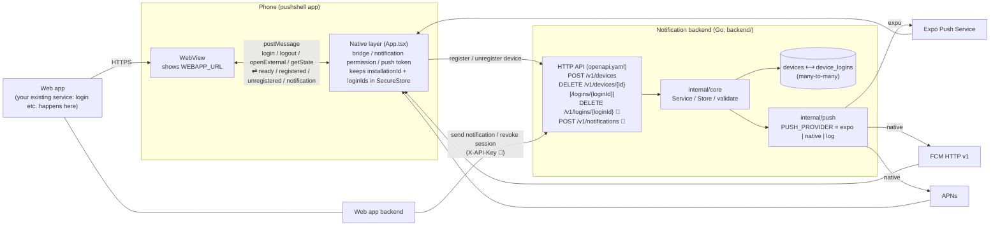
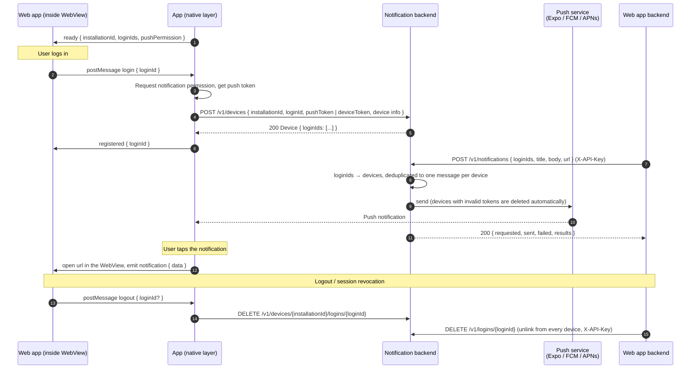

# pushshell

[](https://github.com/nonchan7720/pushshell/actions/workflows/ci.yml)
[](LICENSE)

English | [日本語](README.ja.md)

**Turn your web app into a native iOS / Android app with push notifications, without rewriting it.**

pushshell is a monorepo with two parts:

- a **WebView shell app** (React Native / Expo) that shows your existing web app and only
  handles the native bits: notification permission, push tokens, and deep-linking a tapped
  notification back into the web app;
- a **notification backend** (Go) that maps your *login IDs* to devices and delivers pushes
  through Expo Push, FCM and APNs. It runs as a plain binary (sqlite / MySQL / PostgreSQL) or
  on Cloudflare Workers + D1 within the free plan.

Your web app keeps owning login, UI and business logic. It talks to the shell through a tiny
`postMessage` bridge, and your web backend sends notifications with a single HTTP call:

```sh
curl -X POST https://push.example.com/v1/notifications \
  -H 'Content-Type: application/json' -H 'X-API-Key: ...' \
  -d '{"loginIds":["user-1"],"title":"Hello","body":"You have a new message","url":"https://example.com/inbox"}'
```

```
.
├── app/        React Native (Expo) app. URL / name / icons are injected from env at build time
├── backend/    Go notification backend (ent + Atlas; sqlite / mysql / postgres; Cloudflare Workers + D1)
├── openapi/    The contract between app and backend (both sides are generated from it)
├── examples/   Static page to exercise the bridge
├── docs/       Roadmap and demo evidence
└── .mise.toml  Toolchain and task definitions (the entry point for development)
```

> `app/README.md` and `backend/README.md` are currently written in Japanese. English versions
> are on the [roadmap](docs/ROADMAP.md); contributions are welcome.

## Architecture



The same backend has two entry points.

| Entry point | Runtime | DB | Differences |
|---|---|---|---|
| `cmd/server` | Plain Go binary (no CGO) | sqlite / mysql / postgres (`internal/store/entstore`, ent + Atlas migrations) | Full OpenAPI request validation via kin-openapi |
| `cmd/worker` | Cloudflare Workers (`GOOS=js GOARCH=wasm`, about 2.2 MB gzipped, fits the free plan) | D1 (`internal/store/sqlstore`, plain `database/sql`) | Does not link ent / atlas / kin-openapi. Outbound HTTP goes through `cloudflare/fetch` |

`internal/core` (use cases), `internal/transport/httpapi` (the oapi-codegen server implementation)
and `internal/push` are shared by both.

### From login to notification



## How it works

1. The app only shows `WEBAPP_URL` in a WebView. Everything else happens in your web app.
2. When the web app logs a user in, it sends
   `window.ReactNativeWebView.postMessage(JSON.stringify({ type: "login", loginId }))`.
3. The app requests notification permission and registers the Expo Push Token (or native
   device token) together with device info via `POST /v1/devices`.
4. Any server posts `{ loginIds, title, body, url }` to `POST /v1/notifications`, and the
   backend pushes to every device linked to those login IDs.
5. When the user taps the notification, the app opens `url` in the WebView.

The `postMessage` protocol is defined in [`app/src/bridge.ts`](app/src/bridge.ts) and the HTTP
API in [`openapi/openapi.yaml`](openapi/openapi.yaml).

## Setup

Install [mise](https://mise.jdx.dev). It provides Node, Go, Atlas and golangci-lint.

```sh
mise install          # toolchain
mise run setup        # go mod download + npm install
mise run gen          # code generation: ent / OpenAPI (Go, TS)
mise tasks            # list all tasks
```

## Run

```sh
# Backend (sqlite; notifications are only logged)
cp backend/.env.example backend/.env   # edit as needed
API_KEY=dev PUSH_PROVIDER=log DB_AUTO_MIGRATE=true mise run backend:run

# App (requires a dev client. Expo Go cannot receive remote notifications on Android)
cp app/.env.example app/.env           # WEBAPP_URL, API_BASE_URL, EAS_PROJECT_ID, ...
mise run app:prebuild
mise run app:run:android   # or app:run:ios
```

Send a notification:

```sh
curl -X POST http://localhost:8080/v1/notifications \
  -H 'Content-Type: application/json' -H 'X-API-Key: dev' \
  -d '{"loginIds":["user-1"],"title":"Hello","body":"You have a new message","url":"https://example.com/inbox"}'
```

## Use it as a template

This repository is a GitHub **template repository**. To build your own app, create a new
repository with **"Use this template"** rather than forking (no history is carried over and the
new repository can be private; forks are for contributing back to this project).

Only four things need changing afterwards. No code changes are required.

1. **App settings** (`app/.env`, copied from `app/.env.example`): the variables in the table
   below. Put icon images under `app/assets/` and point `APP_ICON` etc. at them.
2. **Backend settings**: `API_KEY` / `DB_*` / `PUSH_PROVIDER` and the FCM / APNs credentials in
   `backend/.env` (from `backend/.env.example`). For Cloudflare Workers, set `database_id` in
   `backend/worker/wrangler.toml` and run `wrangler secret put` (see
   [`backend/README.md`](backend/README.md)).
3. **GitHub Actions secrets** (if you build release binaries in CI):
   `ANDROID_KEYSTORE_BASE64` / `ANDROID_KEYSTORE_PASSWORD` / `ANDROID_KEY_ALIAS` /
   `ANDROID_KEY_PASSWORD`, plus `GOOGLE_SERVICES_JSON_BASE64` if you use FCM.
4. **Identifiers** (optional): the Go module path `github.com/nonchan7720/pushshell/backend` is
   only imported inside the monorepo, so it builds and runs as is. To rename it, replace
   `pushshell` / `com.example.pushshell` / `nonchan7720/pushshell` throughout and run
   `mise run gen` (the generated ent code embeds the module path).

`app/` is a template. Changing the following in `app/.env` (or EAS environment variables) turns it
into a different app. Details in [`app/README.md`](app/README.md).

| Variable | Purpose |
|---|---|
| `APP_NAME` / `APP_SLUG` / `APP_SCHEME` | App name, slug and URL scheme |
| `APP_ICON` / `APP_ADAPTIVE_ICON_*` / `APP_SPLASH_*` | Icons and splash screen |
| `IOS_BUNDLE_ID` / `ANDROID_PACKAGE` | Bundle identifiers |
| `WEBAPP_URL` / `ALLOWED_ORIGINS` | URL to show and the allowed origins |
| `API_BASE_URL` | Backend URL |
| `EAS_PROJECT_ID` | Required for Expo Push Tokens |

## Build and run Android locally

mise installs JDK 17. The Android SDK cannot be managed by a mise plugin, so
`mise run android:sdk` installs the required packages (platform-tools, platform 36, build-tools
36.0.0, NDK 27.1, cmake 3.22.1) into `$ANDROID_HOME` (default `~/.android-sdk`). `ANDROID_HOME`
and `PATH` are set in the `[env]` section of `.mise.toml`.

```sh
mise install                        # JDK 17 etc.
mise run android:sdk                # Android SDK
mise run app:build:android:local    # expo prebuild + gradlew assembleDebug → app/android/app/build/outputs/apk/debug/

# With an emulator
mise run android:avd:create         # emulator + system image + AVD
mise run android:emulator           # start (falls back to software emulation without KVM)
mise run app:install:android        # install the APK
mise run app:run:android            # run with Metro (expo run:android)
```

For a physical device, enable USB debugging, confirm it shows up in `mise run android:devices`,
then run `mise run app:run:android`.

Emulator-related variables (`[env]` in `.mise.toml`, overridable in `.env`):

| Variable | Purpose | Default |
|---|---|---|
| `ANDROID_SYSTEM_IMAGE_TAG` | `google_apis` (with Play services, needed to verify FCM) or `default` (AOSP only, lighter) | `google_apis` |
| `ANDROID_AVD_NAME` | AVD name | `pushshell` |
| `ANDROID_EMULATOR_EXTRA_ARGS` | Extra arguments for `emulator` (e.g. `-cores 2 -memory 3072`) | none |

Without KVM (e.g. in CI containers) the emulator runs in software emulation and can take 20 to
30 minutes to boot. `ANDROID_SYSTEM_IMAGE_TAG=default` and about `-cores 2` make it more stable.

## Development tasks

| Task | Purpose |
|---|---|
| `mise run gen` | Generate ent + OpenAPI (Go / TS) code |
| `mise run check` | vet + test + typecheck |
| `mise run backend:run` / `backend:test` / `backend:lint` | Backend |
| `mise run db:diff <name> --dialect sqlite\|mysql\|postgres` | Generate a migration from the ent schema |
| `mise run db:apply` / `db:status` / `db:lint` | Apply and check migrations with Atlas |
| `mise run app:start` / `app:typecheck` / `app:build:android` / `app:build:ios` | App (EAS Build) |
| `mise run android:sdk` / `android:avd:create` / `android:emulator` / `android:devices` | Android SDK and emulator |
| `mise run app:build:android:local` / `app:build:android:bundle` / `app:install:android` / `app:run:android` | Local Android build (APK / AAB) and run |

The database is selected with `DB_DIALECT` (sqlite / mysql / postgres) and `DB_DSN`, and
`ATLAS_URL` for Atlas. Generating mysql / postgres migrations needs Docker for the Atlas dev
database. See [`backend/README.md`](backend/README.md).

## CI

| Workflow | Trigger | What it does |
|---|---|---|
| `ci.yml` | PRs and pushes to main | `backend`: generated code is up to date, vet / lint / test, CGO-free build, migration consistency. `worker`: wasm build, checks that ent / atlas / kin-openapi are not linked, boots the built wasm with wrangler dev (workerd) + local D1 and smoke-tests the API, 3 MB gzip size gate. `app`: generated types are up to date, typecheck |
| `android-apk.yml` (Android Build) | Manual (`workflow_dispatch`) | Builds with `APP_NAME` / `ANDROID_PACKAGE` / `WEBAPP_URL` / `API_BASE_URL` / `PUSH_PROVIDER` etc. from inputs and the artifact type (`apk` / `aab` / `both`), then uploads the artifact. New Google Play apps require AAB. Signs the release build when `ANDROID_KEYSTORE_BASE64` etc. are present, bundles FCM config when `GOOGLE_SERVICES_JSON_BASE64` is present |
| `android-emulator.yml` | Manual (`workflow_dispatch`) | Boots an emulator on a KVM-enabled ubuntu runner, installs and launches the release APK (x86_64). Connects to a backend on the runner (`PUSH_PROVIDER=log`) and `examples/webapp` via `10.0.2.2`, uploads screenshots and logcat |

`android-apk.yml` can also be called with `workflow_call` from other workflows. All actions are
pinned to commit SHAs.

The emulator smoke test itself is `scripts/android/emulator-smoke.sh`. Locally, start the emulator
with `mise run android:emulator` and run the same checks with `mise run android:smoke`.

## Roadmap and contributing

See [`docs/ROADMAP.md`](docs/ROADMAP.md) for where the project is heading and
[`CONTRIBUTING.md`](CONTRIBUTING.md) for how to help. Issues and pull requests are welcome in
English or Japanese.

## License

[MIT](LICENSE)
